Analysis of HydroLAKES and GLOBathy databases to generate lake morphometry for ISIMIP3
================
Rafael Marcé and Daniel Mercado,
March 2022

## Antecedents

During the ISIMIP Lake Sector in February 2022 the community decides to
change the strategy to define representative lakes per pixel for ISIMIP3
runs. In a separate previous analysis, the representative lakes per
pixel have been identified calculating the weighted median lake depth,
using lake area as weights. In this way, individual lakes have been
selected at each pixel, for a total of 41449 lakes. The selected lakes
correspond to real lakes in the HydroLAKES database.

In this part of the analysis, we will define the morphometry of each
lake (hypsographic curve). In ISIMIP2 all lakes had a cylyndrical shape,
and the majority of modellers were in favour of trying to define a more
realistic shape for each representative lake.

Taking advantage of the recent publication of the GLOBathy database
(<https://www.nature.com/articles/s41597-022-01132-9>), which estimates
maximum depth and bathymetric information for all lakes in HydroLAKES,
we analyze which is the best alternative to represent lake morphometry
in the most efficient way in ISIMIP3 runs.

This task was led by the authors above, with contributions by Inne
Vanderkelen, Maddalena Tigli, Iestyn Woolway, Annette Janssen, Benjamin
Kraemer, Mahtab Yaghouti, Sebastiano Piccolroaz, Wim Thiery, and Don
Pierson

## Opening databases and checking coherence

Loading the attribute table of the HydroLAKES polygons (~1.4M lakes).
You will likely have to insert your local path to find the file - too
big to be stored at Github. Can be downloaded from here:
<https://97dc600d3ccc765f840c-d5a4231de41cd7a15e06ac00b0bcc552.ssl.cf5.rackcdn.com/HydroLAKES_polys_v10_shp.zip>

``` r
HydroLakes <- read.dbf("/home/rmarce/Cloud/a. WATExR/ISIMIP/Area_depth February 2022/Hydrolakes/HydroLAKES_polys_v10_shp/HydroLAKES_polys_v10.dbf")
```

Loading basic morphometric parameters from Khazaei et al. (2022). Can be
downloaded here:
<https://springernature.figshare.com/collections/GLOBathy_the_Global_Lakes_Bathymetry_Dataset/5243309>

``` r
Globathy_basic <-read.csv("/home/rmarce/Cloud/a. WATExR/ISIMIP/ISIMIP Lake Sector Feb 2022 - ICRA PC/GLOBathy/GLOBathy_basic_parameters/GLOBathy_basic_parameters(ALL_LAKES).csv",header=T)
```

Checking order to make sure we do not mess with different lakes, this
sum must be zero

``` r
sum(HydroLakes$Hylak_id-Globathy_basic$Hylak_id)
```

    ## [1] 0

Adding maximum depth (Dmax) from GLOBathy to HydroLakes. Using the Dmax
result reccommended in Khazaei et al. (2022) from several alternatives

``` r
HydroLakes$Dmax_Khazaei <- Globathy_basic$Dmax_use_m
```

Comparing Dmax in GLOBathy vs Dmean in HydroLAKES. Some impossible
situations (Dmax\<mean depth)

Using ratios:

``` r
ratio_mm <-HydroLakes$Dmax_Khazaei/HydroLakes$Depth_avg 
summary(ratio_mm)
```

    ##      Min.   1st Qu.    Median      Mean   3rd Qu.      Max. 
    ##   0.02705   2.22827   3.24813   3.94063   4.75387 227.74006

``` r
hist(log10(ratio_mm))
```

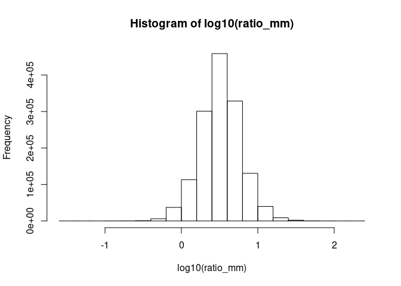<!-- -->

Using differences:

``` r
dif_mm <- HydroLakes$Dmax_Khazaei-HydroLakes$Depth_avg
summary(dif_mm)
```

    ##     Min.  1st Qu.   Median     Mean  3rd Qu.     Max. 
    ## -556.330    4.822    7.611    7.570   10.056  903.300

``` r
hist(dif_mm)
```

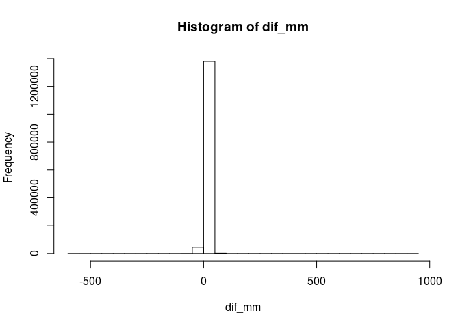<!-- -->

``` r
boxplot(dif_mm)
```

<!-- -->

Percent of impossible values using Dmax from GLOBathy and Dmean from
HydroLAKES:

``` r
length(which(dif_mm<0))/length(dif_mm)*100
```

    ## [1] 3.123091

Checking the volume development parameter (Vd) using Dmax from GLOBathy
and Dmean from HydroLAKES (should between 0 and 3) Note the nonsense
values (\>3) and the median \<1, which is not very realistic considering
classical literature (for instance:
<https://doi.org/10.1016/B978-012370626-3.00024-7>,
<https://link.springer.com/article/10.1007/s10666-006-9069-z>,
<http://www.jstor.org/stable/520579> )

``` r
HydroLakes$Vd  <- 3*HydroLakes$Depth_avg/HydroLakes$Dmax_Khazaei
summary(HydroLakes$Vd)
```

    ##      Min.   1st Qu.    Median      Mean   3rd Qu.      Max. 
    ##   0.01317   0.63107   0.92361   1.11600   1.34633 110.89223

``` r
hist(log10(HydroLakes$Vd)) 
```

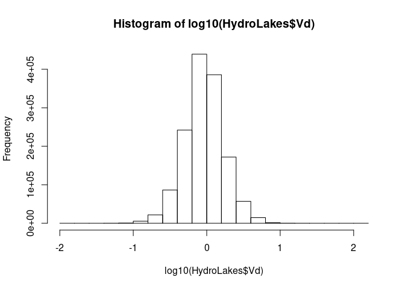<!-- -->

``` r
hist((HydroLakes$Vd),xlim=c(0,3),breaks=400)
```

<!-- -->

## Using GLOBathy as the only lake morphometry source

Loading extended morphological information from GLOBathy (NetCDF file)
Can be downloaded here:
<https://springernature.figshare.com/collections/GLOBathy_the_Global_Lakes_Bathymetry_Dataset/5243309>

``` r
nc_data <- nc_open('/home/rmarce/Cloud/a. WATExR/ISIMIP/ISIMIP Lake Sector Feb 2022 - ICRA PC/GLOBathy/GLOBathy_hAV_relationships.nc')
# Save the print(nc) dump to a text file
{
  sink('gimms3g_ndvi_1982-2012_metadata.txt')
  print(nc_data)
  sink()
}
```

Extracting the lake basic attributes: max depth, mean depth, surface
area, total volume (m, m, km2, km3)

``` r
attri_nc <- ncvar_get(nc_data, "lake_attributes")
attri_nc[1:4,1:3]#just to look at aspect
```

    ##             [,1]       [,2]       [,3]
    ## [1,]   1025.0000   446.0000   614.0000
    ## [2,]    317.5679   108.5791   133.3336
    ## [3,] 376904.5992 30574.0173 26664.3815
    ## [4,] 119692.8818  3319.7045  3555.2596

Collecting maximum volume and area, and maximum and mean depth

``` r
A_Khazaei <- attri_nc[3,] 
V_Khazaei <- attri_nc[4,]
Dmax_Khazaei <- attri_nc[1,] 
Dmean_Khazaei <-attri_nc[2,] 
```

Comparison with HydroLAKES volume (note, volume in HydroLAKES is in
0.001 km3). There are substantial differences.

``` r
plot(HydroLakes$Vol_total*0.001,V_Khazaei,log="xy")
abline(0,1)
```

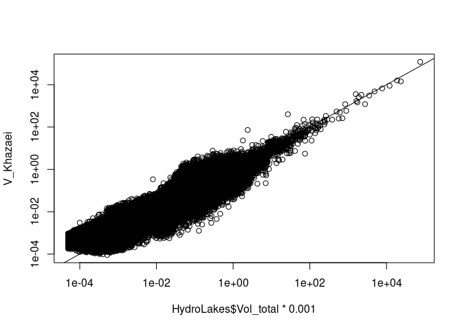<!-- -->

The same using percent
differences:

``` r
dif_volume <- (HydroLakes$Vol_total*0.001-V_Khazaei)/(HydroLakes$Vol_total*0.001)*100
hist(dif_volume)
```

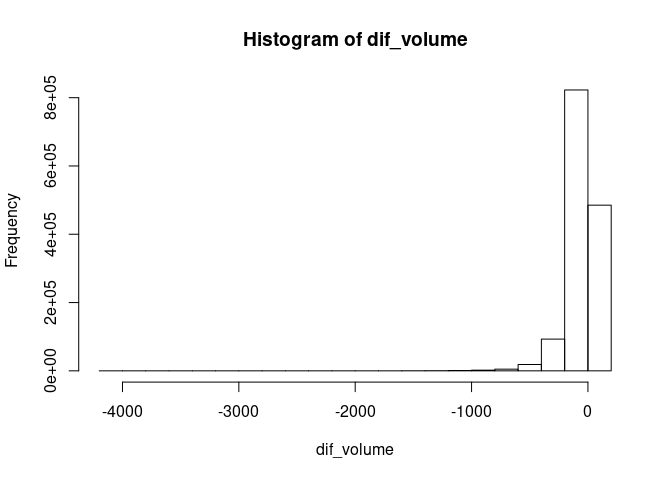<!-- -->

Comparison with HydroLAKES areas. Very small differences, probably
related to rasterization in Khazaei procedure

``` r
plot(HydroLakes$Lake_area,A_Khazaei,log="xy")
abline(0,1)
```

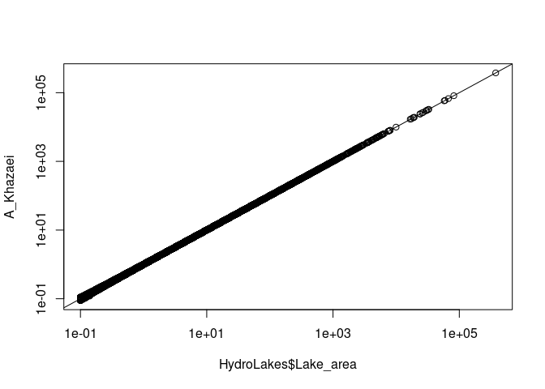<!-- -->
The same using percent difference

``` r
dif_area <- (HydroLakes$Lake_area-A_Khazaei)/HydroLakes$Lake_area*100
hist(dif_area)
```

<!-- -->

Comparison with HydroLAKES mean depth. Substantial differences (this
coherent with the volume comparison)

``` r
plot(HydroLakes$Depth_avg,Dmean_Khazaei,log="xy")
abline(0,1)
```

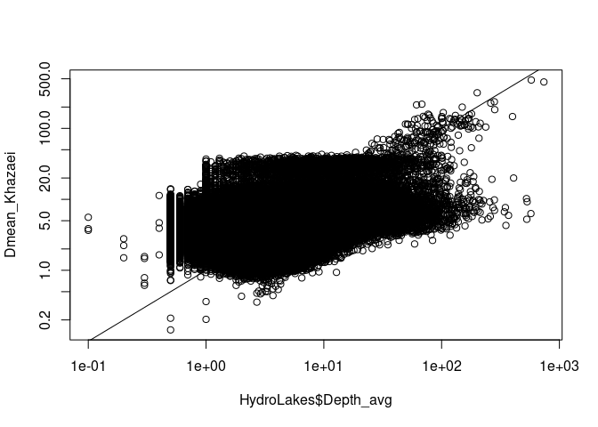<!-- -->

The same using percent
differences:

``` r
dif_Dmean <- (HydroLakes$Depth_avg-Dmean_Khazaei)/HydroLakes$Depth_avg*100
hist(dif_Dmean)
```

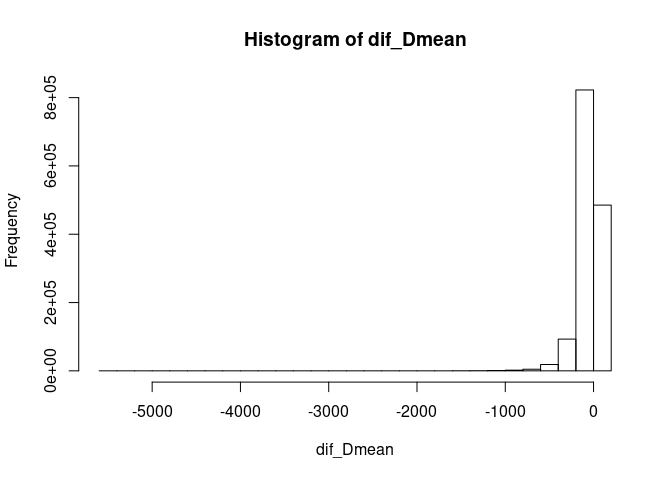<!-- -->

Comparing overall volume and area (sum of all lakes), in percent. Again,
area is virtually the same, volume is substantially different. We will
have to accept this difference between GLOBathy and a frequently used
reference product (HydroLAKES) for the shake of coherence between
morphological parameters (that is, using only GLOBathy estimates instead
of merging Dmax from GLOBathy with Area and Dmean from
HydroLAKES)

``` r
(sum(V_Khazaei)-sum(HydroLakes$Vol_total)*0.001)/(sum(HydroLakes$Vol_total)*0.001)*100
```

    ## [1] 13.43514

``` r
(sum(A_Khazaei)-sum(HydroLakes$Lake_area))/(sum(HydroLakes$Lake_area))*100
```

    ## [1] 0.04528627

Let’s see which is the distribution of the volume development parameter
when using data from Khazaei exclusively. The result is very good, well
centered in values slightly above one, with no values \>3. Nice
distribution coherent with what is expected for a large population of
lakes.

``` r
Vd_Khazaei  <- 3*Dmean_Khazaei/Dmax_Khazaei
summary(Vd_Khazaei)
```

    ##    Min. 1st Qu.  Median    Mean 3rd Qu.    Max. 
    ##  0.2925  1.0925  1.1897  1.1859  1.2831  3.0000

``` r
hist((Vd_Khazaei))
```

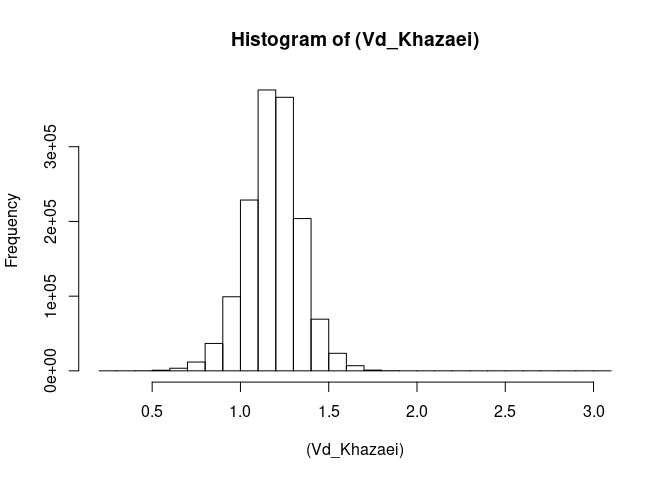<!-- -->

## Aaalyzing GLOBathy morphological parameters for the selected representative lakes in ISIMIP3

Extracting lakes ID from GLOBathy databse

``` r
nc_lake_ID <- ncvar_get(nc_data, "lake_id")
dim(nc_lake_ID)
```

    ## [1] 1427688

Loading the shapefile attribute table with the selected representative
lakes for ISIMIP3. You will need to update file location. File
downloadable here:
<https://u.pcloud.link/publink/show?code=XZyRpVVZaYEwrorqPtf4B20TrqqhQzOd3La7>

``` r
data_selected<-read.dbf("/home/rmarce/Cloud/a. WATExR/ISIMIP/ISIMIP Lake Sector Feb 2022 - ICRA PC/HL_selected.dbf")
head(data_selected$Hylak_id)
```

    ## [1] 1 2 3 4 5 6

Subsetting the GLOBathy attributes for the selected representative lakes

``` r
attri_nc_selected <- attri_nc[,data_selected$Hylak_id]
dim(attri_nc_selected)
```

    ## [1]     4 41449

``` r
attri_nc_selected[,1:10]
```

    ##             [,1]       [,2]       [,3]        [,4]       [,5]        [,6]
    ## [1,]   1025.0000   446.0000   614.0000    36.00000   406.0000   281.00000
    ## [2,]    317.5679   108.5791   133.3336     9.26957   109.0317    82.59213
    ## [3,] 376904.5992 30574.0173 26664.3815 24204.68914 81600.2878 57915.66845
    ## [4,] 119692.8818  3319.7045  3555.2596   224.36663  8897.0362  4783.37728
    ##             [,7]        [,8]       [,9]       [,10]
    ## [1,]   244.00000   229.00000    64.0000   230.00000
    ## [2,]    87.88894    51.67919    20.7857    68.57117
    ## [3,] 19303.14363 59618.40817 25785.0305 17449.70753
    ## [4,]  1696.53404  3081.02167   535.9601  1196.54594

Atttributes to variables

``` r
A_Khazaei_selected <- attri_nc_selected[3,]
V_Khazaei_selected <- attri_nc_selected[4,]
Dmax_Khazaei_selected <- attri_nc_selected[1,]
Dmean_Khazaei_selected <-attri_nc_selected[2,] 
```

Volume development (Vd) for selected representative lakes and comparison
with the distribution of the 1.4M lakes (in red the global distirbution,
in black the representative lakes). There is a bias towards smaller Kd
values, probably becasue we are biased towards larger lakes in the
representative lakes selection.

``` r
Vd_Khazaei_selected  <- 3*Dmean_Khazaei_selected/Dmax_Khazaei_selected
summary(Vd_Khazaei_selected)
```

    ##    Min. 1st Qu.  Median    Mean 3rd Qu.    Max. 
    ##  0.2925  0.9719  1.1035  1.0904  1.2179  1.9001

``` r
summary(Vd_Khazaei)
```

    ##    Min. 1st Qu.  Median    Mean 3rd Qu.    Max. 
    ##  0.2925  1.0925  1.1897  1.1859  1.2831  3.0000

``` r
plot(density(Vd_Khazaei), col="red")
lines(density(Vd_Khazaei_selected))
```

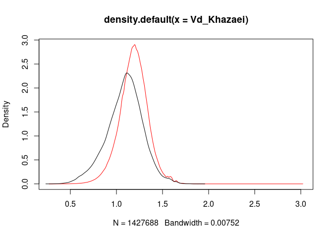<!-- -->

``` r
p=seq(0,1,0.01)
plot(quantile(Vd_Khazaei,p), p, type="l", col="red",xlab="Vd")
lines(quantile(Vd_Khazaei_selected,p), p)
```

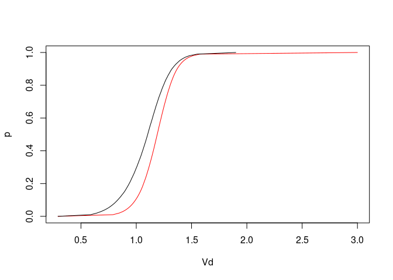<!-- -->

Comparing volumes and areas in GLOBathy with HydroLAKES for selected
representative lakes. Similar result as above when comparing the whole
dataset.

``` r
plot(HydroLakes$Vol_total[data_selected$Hylak_id]*0.001,V_Khazaei_selected,log="xy")
abline(0,1)
```

<!-- -->

``` r
plot(HydroLakes$Lake_area[data_selected$Hylak_id],A_Khazaei_selected,log="xy")
abline(0,1)
```

<!-- -->

Just out of curiosity, Vd has a dependency on Area. Larger lakes have
more shallow litoral
areas.

``` r
plot(A_Khazaei_selected,Vd_Khazaei_selected,log="x")
```

<!-- -->

## Saving rasters with basic morphometric parameters for ISIMIP3 using GLOBathy data exclusively

``` r
#loading lake_ID of representative lakes for reference to assign values to rasters
raster_id <- raster("../../output/Hylak_id.tif")
raster_id_asmatrix <- as.matrix(raster_id)#to speed up

#initializing matrices that will eventually become the rasters
matrix_vd <- matrix(data = NA, nrow=360, ncol = 720) #empty matrix
matrix_A <- matrix(data = NA, nrow=360, ncol = 720) #empty matrix
matrix_V <- matrix(data = NA, nrow=360, ncol = 720) #empty matrix
matrix_Dmax <- matrix(data = NA, nrow=360, ncol = 720) #empty matrix
matrix_Dmean <- matrix(data = NA, nrow=360, ncol = 720) #empty matrix

#loop for assigning values in the matrices 
for (i in 1:360){ 
  for (j in 1:720){ 
    #print(i);print(j)
    if (is.na(raster_id_asmatrix[i,j])) {#to avoid the loop crashing
      }else{
        #identifying which lake goes to the current position
      position <- which(data_selected$Hylak_id == raster_id_asmatrix[i,j])
      matrix_vd[i,j] <-  Vd_Khazaei_selected[position]
      matrix_A[i,j] <-  A_Khazaei_selected[position]
      matrix_V[i,j] <-  V_Khazaei_selected[position]
      matrix_Dmax[i,j] <-  Dmax_Khazaei_selected[position]
      matrix_Dmean[i,j] <-  Dmean_Khazaei_selected[position]
    }
  }
}

## converting to raster and writing data
Vd_raster <- raster(matrix_vd)
A_raster <- raster(matrix_A)
V_raster <- raster(matrix_V)
Dmax_raster <- raster(matrix_Dmax)
Dmean_raster <- raster(matrix_Dmean)

extent(Vd_raster) <- extent(c(-180,180,-90,90))
extent(A_raster) <- extent(c(-180,180,-90,90))
extent(V_raster) <- extent(c(-180,180,-90,90))
extent(Dmax_raster) <- extent(c(-180,180,-90,90))
extent(Dmean_raster) <- extent(c(-180,180,-90,90))

crs(Vd_raster) <- "+proj=longlat +datum=WGS84 +no_defs +ellps=WGS84 +towgs84=0,0,0"
crs(A_raster) <- "+proj=longlat +datum=WGS84 +no_defs +ellps=WGS84 +towgs84=0,0,0" 
crs(V_raster) <- "+proj=longlat +datum=WGS84 +no_defs +ellps=WGS84 +towgs84=0,0,0" 
crs(Dmax_raster) <- "+proj=longlat +datum=WGS84 +no_defs +ellps=WGS84 +towgs84=0,0,0" 
crs(Dmean_raster) <- "+proj=longlat +datum=WGS84 +no_defs +ellps=WGS84 +towgs84=0,0,0" 

writeRaster(Vd_raster,"./Results/Vd_raster.tif", overwrite=T)
writeRaster(A_raster,"./Results/A_raster.tif", overwrite=T)
writeRaster(V_raster,"./Results/V_raster.tif", overwrite=T)
writeRaster(Dmax_raster,"./Results/Dmax_raster.tif", overwrite=T)
writeRaster(Dmean_raster,"./Results/Dmean_raster.tif", overwrite=T)
```

Both Vd and Dmax show very interesting spatial patterns, very nice to
have this for ISIMIP3 runs\!

``` r
plot(Vd_raster,col=viridis(2),main="Vd")
```

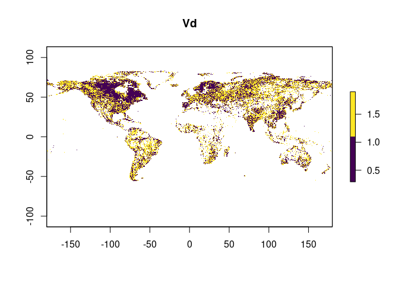<!-- -->

``` r
plot(log10(Dmax_raster),col=viridis(2), main="Dmax")
```

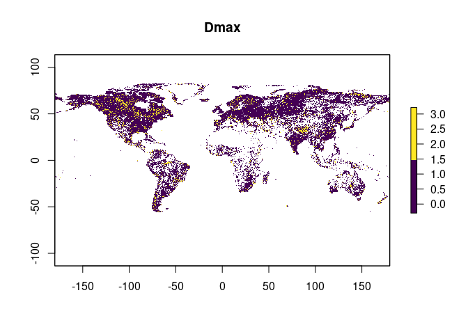<!-- -->

Cheching Vd raster against area and Dmean rasters. Errors look like
rounding errors during calculations

``` r
aa<-(V_raster/(A_raster*Dmean_raster*0.001))
summary(aa)
```

    ##                layer
    ## Min.    9.999970e-01
    ## 1st Qu. 1.000000e+00
    ## Median  1.000000e+00
    ## 3rd Qu. 1.000000e+00
    ## Max.    1.000002e+00
    ## NA's    2.177510e+05

``` r
hist(aa)
```

<!-- -->

Cheching Vd raster against the calculation using the corresponding
rasters. No errors

``` r
bb<-(Vd_raster/(3*Dmean_raster/Dmax_raster))
summary(bb)
```

    ##          layer
    ## Min.         1
    ## 1st Qu.      1
    ## Median       1
    ## 3rd Qu.      1
    ## Max.         1
    ## NA's    217751

## Producing and saving variables with the GLOBathy hypsografics for all ISIMIP3 representative lakes

First we extract the lakes\_ID

``` r
nc_lake_ID_selected <- nc_lake_ID[data_selected$Hylak_id]
sum(nc_lake_ID_selected-data_selected$Hylak_id) #for checking, must be zero if all fine
```

    ## [1] 0

``` r
write.table(nc_lake_ID_selected,"./Results/GLOBATHY_lakes_ID_representative.csv",sep=",", row.names=F, col.names=F)
```

Then the water level index for the hypsographic curves (in m) The lake
bottom is the reference level\!\!\! (i.e., level=0 corresponds to
bottom)

``` r
nc_level <- ncvar_get(nc_data, "h") #get the variable form the NetCFD object
dim(nc_level)
```

    ## [1]      11 1427688

``` r
nc_level_selected <- nc_level[,nc_lake_ID_selected]
dim(nc_level_selected)
```

    ## [1]    11 41449

``` r
write.table(nc_level_selected,"./Results/GLOBATHY_hypso_levels_representative.csv",sep=",", row.names=F, col.names=F)
```

Then the Area at each level in the hypsographic curves (in
km2)

``` r
nc_area <- ncvar_get(nc_data, "A") #get the variable form the NetCFD object
dim(nc_area)
```

    ## [1]      11 1427688

``` r
nc_area_selected <- nc_area[,nc_lake_ID_selected]
dim(nc_area_selected)
```

    ## [1]    11 41449

``` r
write.table(nc_area_selected,"./Results/GLOBATHY_hypso_areas_representative.csv",sep=",", row.names=F, col.names=F)
```

Then the Volume at each level in the hypsographic curves (in
km3)

``` r
nc_volume <- ncvar_get(nc_data, "V") #get the variable form the NetCFD object
dim(nc_volume)
```

    ## [1]      11 1427688

``` r
nc_volume_selected <- nc_volume[,nc_lake_ID_selected]
dim(nc_volume_selected)
```

    ## [1]    11 41449

``` r
write.table(nc_volume_selected,"./Results/GLOBATHY_hypso_volumes_representative.csv",sep=",", row.names=F, col.names=F)
```

Next is the parameters for a fit of the Lake level-Area relationship
coefficients - A=ah^b where h is water level (with respect to the lake
bottom) in (m) and A is area in (km^2) a and b are fitted parameters
(first and second row in the collector variable). The third row is for
R2, a measure of goodness of
fit.

``` r
nc_fit_area <- ncvar_get(nc_data, "f_hA") #get the variable form the NetCFD object
dim(nc_fit_area)
```

    ## [1]       3 1427688

``` r
nc_fit_area_selected <- nc_fit_area[,nc_lake_ID_selected]
dim(nc_fit_area_selected)
```

    ## [1]     3 41449

``` r
nc_fit_area_selected[,1:10]
```

    ##           [,1]         [,2]         [,3]      [,4]        [,5]      [,6]
    ## [1,] 0.1252679 0.0002714164 8.533883e-06 1.0255491 0.008279689 0.1363607
    ## [2,] 2.1489200 3.0356478733 3.391482e+00 2.7993768 2.677548695 2.2913858
    ## [3,] 0.9989902 0.9981499123 9.551063e-01 0.9943664 0.998112805 0.9950461
    ##           [,7]         [,8]      [,9]      [,10]
    ## [1,] 1.8092054 0.0006843075 5.1770598 0.08849144
    ## [2,] 1.6825406 3.3577694960 2.0427264 2.23373265
    ## [3,] 0.9982734 0.9923424447 0.9986206 0.99264185

``` r
write.table(nc_fit_area_selected,"./Results/GLOBATHY_hypso_fitArea_representative.csv",sep=",", row.names=F, col.names=F)
```

Next is the parameters for a fit of the Lake level-Volume relationship
coefficients - V=ah^b where h is water level (with respect to the lake
bottom) in (m) and V is volume in (km^3) a and b are fitted parameters
(first and second row in the collector variable). The third row is for
R2, a measure of goodness of
fit.

``` r
nc_fit_volume <- ncvar_get(nc_data, "f_hV") #get the variable form the NetCFD object
dim(nc_fit_volume)
```

    ## [1]       3 1427688

``` r
nc_fit_volume_selected <- nc_fit_volume[,nc_lake_ID_selected]
dim(nc_fit_volume_selected)
```

    ## [1]     3 41449

``` r
nc_fit_volume_selected[,1:10]
```

    ##              [,1]         [,2]         [,3]        [,4]         [,5]
    ## [1,] 6.478113e-05 3.169575e-07 8.443940e-06 0.001163553 1.025602e-05
    ## [2,] 3.077857e+00 3.781539e+00 3.089993e+00 3.393432072 3.425674e+00
    ## [3,] 9.999932e-01 9.999152e-01 9.983019e-01 0.999526423 9.997437e-01
    ##              [,6]        [,7]         [,8]        [,9]        [,10]
    ## [1,] 0.0001544137 0.000824723 6.050781e-06 0.002845746 0.0001292768
    ## [2,] 3.0579618936 2.644573635 3.687661e+00 2.919225337 2.9479521937
    ## [3,] 0.9998158564 0.999941523 9.991289e-01 0.999869806 0.9996367476

``` r
write.table(nc_fit_volume_selected,"./Results/GLOBATHY_hypso_fitVolume_representative.csv",sep=",", row.names=F, col.names=F)
```
